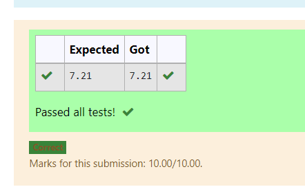

# DISTANCE-BETWEEN-TWO-POINTS

## AIM:
To write a python program to find the distance between two points

## ALGORITHM:
### Step 1: 
Import math function.

### Step 2: 
Assign the values of point 1 and point 2 whose distance is to be calculated.

### Step 3: 
Substitute the values in the distance formula  

### Step 4: 
Print the coding to get the distance.

### Step 5: 
End the program.

### PROGRAM:
```
#Program to find the distance between two points
#Developed by:Vaishnavi M
#RegisterNumber:21500310
import math
a=[10,6]
b=[4,2]
value=math.sqrt(((b[0]-a[0])**2)+((b[1]-a[1])**2))
print("{:.2f}".format(value))
``` 


### OUTPUT:



### RESULT:
Thus, a program is successfully executed to find the distance between two points.
